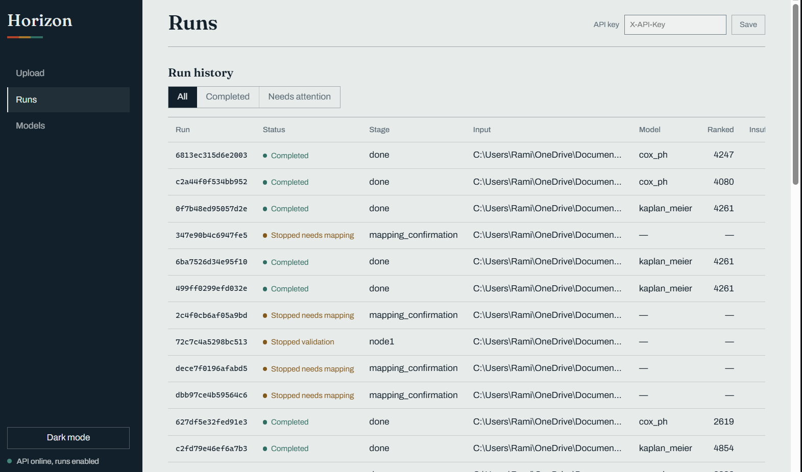
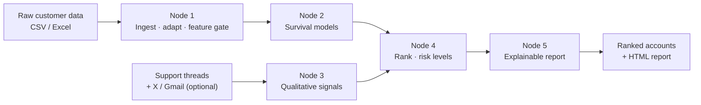
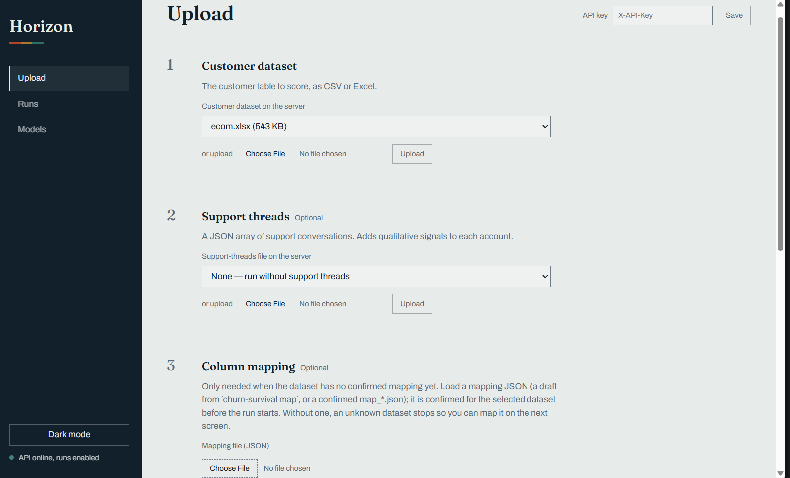
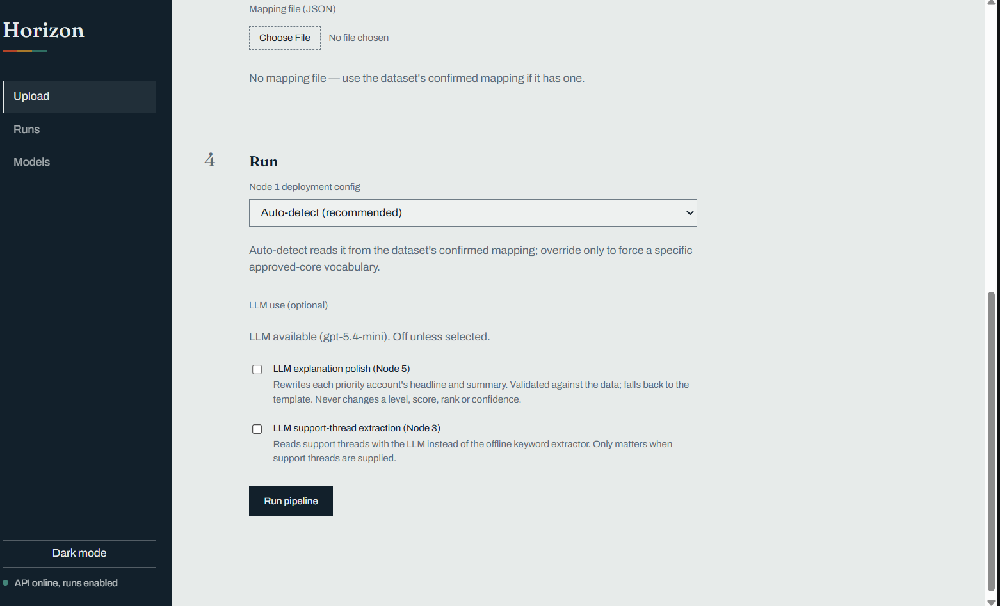
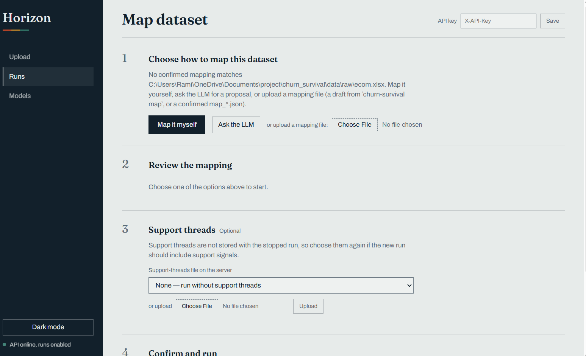

# Churn Survival



Churn Survival turns heterogeneous customer data (CSV / Excel) plus optional
support threads into a **ranked, explainable churn-risk report**. It is a
five-stage pipeline with a statistics-only core, a provider-agnostic LLM edge,
a FastAPI service, and a dependency-free web UI ("Horizon").

The system is built to be honest: it is allowed to say **"I don't know"**, the
LLM never changes a level, score, rank, or confidence, and every decision traces
back to deterministic evidence.

---

## What it does

- **Ingests messy customer tables** through per-company adapters, validates and
  version-checks every column, and gates features into *core* vs *extra*.
- **Models time-to-churn** with survival analysis (Cox PH and Kaplan–Meier),
  falling back gracefully when a cohort is too small to estimate.
- **Reads support conversations** into a controlled risk-flag vocabulary —
  offline by default, optionally via an LLM or live X / Gmail sources.
- **Ranks accounts** by forward-looking risk, with levels, confidence, and lift.
- **Explains every account** in plain language and renders a static HTML report.

---

## How it works



| Node | Responsibility | Determinism |
|------|----------------|-------------|
| **Node 1** | Route a raw file to a deterministic adapter, validate it, apply the feature gate (Core vs extra), reject future-leaking columns. | Fully deterministic |
| **Node 2** | Fit / load survival models, score per-customer state and horizons, persist versioned artifacts with hashes. | Fully deterministic |
| **Node 3** | Extract risk flags from support threads (offline keyword extractor by default), ingest mock / X / Gmail sources, map identities. | Deterministic offline; optional LLM |
| **Node 4** | Rank accounts, assign risk levels and confidence, compute lift. | Fully deterministic |
| **Node 5** | Write per-account explanations (template by default, LLM-polished on request) and the static HTML report. | Deterministic template; optional LLM |

The LLM is strictly an **edge** concern: it may draft mapping proposals and
polish explanation prose, but every output is validated against the data and
falls back to a deterministic template. It can never change a decision value.

---

## Screenshots

### Upload and trigger a run





### Confirm an unknown dataset's mapping



### Review ranked runs


---

## Repository layout

```
adapters/        Per-company deterministic file adapters and mapping helpers
schemas/         Pydantic contracts for every node boundary (strictly typed)
router/          Adapter routing, fingerprinting, mapping drafts
node1/           Ingestion, validation, feature gate
node2/           Survival modelling and model artifacts
node3/           Support-thread and external-source signal extraction
node4/           Ranking, risk levels, confidence
node5/           Explanations, recommendations, HTML report
orchestration/   Pipeline orchestration, persistence, run store, GC
api/             FastAPI service (reads open, writes key-gated)
frontend/        "Horizon" static UI (no build step, no dependencies)
config/          Versioned configuration (node1…node5, mappings, rules)
pipeline/        `churn-survival` CLI entry point
scripts/          Dataset generators, evaluation and reproducibility tooling
docs/img/        Screenshots used by this README
tests/           Pytest suite (unit, contract, e2e, golden, adversarial)
```

---

## Quickstart

Requires **Python 3.11 or 3.12**.

```bash
git clone https://github.com/rm12000356/churn_survival.git
cd churn_survival

python -m venv .venv
# Windows
.venv\Scripts\activate
# macOS / Linux
source .venv/bin/activate

pip install -e ".[dev]"
cp .env.example .env        # Windows: copy .env.example .env
```

Edit `.env` for an offline run:

```dotenv
REFERENCE_DATE=2026-08-15
LLM_PROVIDER=none
```

Run the guided pipeline against a raw dataset:

```bash
churn-survival run data/raw/your_dataset.xlsx --node1 auto \
    --persist-run --output result.json
```

Start the API and the Horizon UI:

```bash
churn-survival-api          # http://127.0.0.1:8000
```

Open the URL, paste your API key into the sidebar, then **Upload → Run →
Report**.

---

## CLI

The single entry point is `churn-survival`:

```text
churn-survival <node1|node2|node3|node4|node5|run|map|gc|audit>
```

| Command | Purpose |
|---------|---------|
| `churn-survival node1 <raw-file> [--config <version>]` | Ingest one raw file. |
| `churn-survival node2 <raw-file> [--config <v>] [--model-config <v>]` | Fit / load survival models. |
| `churn-survival node3 [<threads.json>] [--customers <ids>] [--sources x,gmail\|mock] [--output <out.json>]` | Extract signals. |
| `churn-survival node4 [--node2 <json>] [--node3 <json>] [--output <out.json>]` | Rank and assign levels. |
| `churn-survival node5 --node4 <json> [--html <out.html>]` | Build the report. |
| `churn-survival run <raw-file> [flags]` | Orchestrate the whole pipeline (persist artifacts / runs). |
| `churn-survival map <raw-file> [--llm] [--out <draft.json>]` | Draft a column mapping for an unknown dataset. |
| `churn-survival map <draft.json> --confirm` | Confirm a reviewed mapping. |
| `churn-survival gc [--models N] [--runs N] [--recover]` | Retention / cleanup and crash recovery. |
| `churn-survival audit` | Reproducibility audit over stored runs. |

See `--help` on any command for the full flag list.

---

## HTTP API and Horizon UI

```bash
churn-survival-api
```

- Reads are **open** by default; **writes are disabled** and require an API key.
- Setting `API_ENABLE_WRITES=true` without `API_KEY` is a startup error.
- The static frontend is mounted at `/` when `FRONTEND_DIR` exists. Explicit
  API routes keep precedence.

Key endpoints:

| Method | Path | Description |
|--------|------|-------------|
| `GET` | `/health` | Service and capability status. |
| `GET` | `/raw-files`, `/raw-files/{name}` | List / fetch server-side inputs. |
| `POST` | `/uploads` | Upload a dataset or support-threads file. |
| `POST` | `/runs` | Trigger a pipeline run. |
| `GET` | `/runs`, `/runs/{id}` | Run history / status. |
| `GET` | `/runs/{id}/ranked-accounts` | Ranked accounts (Node 4). |
| `GET` | `/runs/{id}/report`, `/report.html` | Node 5 JSON / static HTML report. |
| `GET` | `/runs/{id}/node1…node5` | Per-node outputs. |
| `POST` | `/mappings/draft`, `/mappings/candidates`, `/mappings/confirm` | Mapping workflow. |
| `GET` | `/models`, `/models/{version}` | Model inspection. |
| `GET` | `/node1-configs` | Available Node 1 configs. |

The UI renders decision values **verbatim** — it never recomputes a level,
score, rank, or confidence.

---

## Configuration

All settings come from environment variables (see `.env.example`). Pipeline
behaviour is versioned under `config/<node>/v*.json`.

| Variable | Default | Notes |
|----------|---------|-------|
| `REFERENCE_DATE` | — | Declared dataset cut-off. Required; never "today". |
| `LLM_PROVIDER` | `none` | `anthropic`, `openai`, or `none`. |
| `LLM_API_KEY`, `LLM_MODEL` | — | Provider credentials / model id. |
| `MODEL_DIR`, `RAW_DATA_DIR`, `PROCESSED_DATA_DIR`, `RUN_DIR` | data dirs | Storage locations. |
| `CONFIG_DIR` | `config/` | Versioned configuration root. |
| `FRONTEND_DIR` | `frontend/` | Mounted at `/` when present. |
| `API_KEY`, `API_KEY_HEADER` | — / `X-API-Key` | Write authentication. |
| `API_ENABLE_WRITES` | `false` | Enables mutating endpoints. |
| `API_REQUIRE_KEY_FOR_READS` | `false` | Gate reads too. |
| `API_TRUSTED_PROXIES` | — | Proxy IPs/CIDRs trusted for `X-Forwarded-For` (for per-client limits behind a load balancer). |
| `API_HOST`, `API_PORT` | `127.0.0.1` / `8000` | Bind address. |
| `RUN_MAX_WORKERS` | `2` | Concurrent runs. |
| `NODE3_SOURCE_MODE` | `mock` | `mock` or `live`. |
| `X_ENABLED`, `GMAIL_ENABLED` | `false` | External sources (credentials required). |

Runtime directories (`data/`, `models/`, `runs/`) are gitignored.

---

## Design principles

1. **Determinism first.** Given the same inputs and config versions, outputs are
   identical; run identity is a content fingerprint.
2. **The LLM has zero decision authority.** It may draft or rephrase; validation
   and templates guarantee it never changes a decision value.
3. **"I don't know" is a valid result.** Insufficient data is surfaced, not
   guessed. No fake success.
4. **Strict contracts.** Every node boundary is a Pydantic model; malformed
   payloads fail loudly.
5. **No future leakage.** Features derived after the declared cut-off are
   rejected before they can reach a model.
6. **Explainability by construction.** Each account carries the evidence behind
   its level, score, rank, and confidence.

---

## Onboarding a new dataset

When Node 1 cannot match an adapter, the run stops with
`STOPPED_NEEDS_MAPPING` instead of guessing. Map it once and reuse it:

```bash
# 1. Draft a mapping (offline, or --llm to ask a provider for a proposal)
churn-survival map data/raw/new_dataset.xlsx --out draft.json

# 2. Review draft.json: column → canonical field, transforms, types

# 3. Confirm and register the mapping
churn-survival map draft.json --confirm

# 4. Re-run; the confirmed mapping is now applied automatically
churn-survival run data/raw/new_dataset.xlsx --node1 auto --persist-run
```

If a brand-new *core* feature is required, add it to `schemas/canonical.py`
first, then re-run. The Horizon UI walks through the same steps visually.

---

## Development

```bash
pytest              # full suite (unit, contract, e2e, golden, adversarial)
ruff check .        # lint
mypy schemas        # strict typing for the contract layer
pip-audit           # dependency audit
```

CI runs lint, schema typecheck, dependency audit, a deterministic dataset
generation + validation step, and the full test suite. Datasets are generated
with fixed seeds so results are reproducible across platforms.

---

## License

MIT — see [LICENSE](LICENSE).
